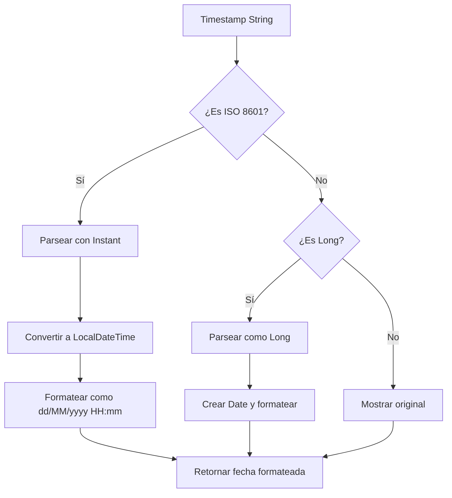

# 🔧 Solución para el Error de Timestamp

## 🚨 Problema Identificado

La aplicación se estaba cerrando debido a un `NumberFormatException` en el `PaymentItemCard.kt`:

```
java.lang.NumberFormatException: For input string: "2025-09-16T02:19:57.144485"
at java.lang.Long.parseLong(Long.java:740)
at org.sysarp.project.ui.components.cards.PaymentItemCardKt.PaymentItemCard$lambda$15(PaymentItemCard.kt:189)
```

## 🔍 Causa del Problema

El error ocurría porque:

1. **Formato de timestamp incorrecto**: El código intentaba convertir un timestamp ISO string a `Long`
2. **Conversión fallida**: `payment.timestamp.toLong()` fallaba porque el timestamp viene como `"2025-09-16T02:19:57.144485"`
3. **Tipo de datos incorrecto**: El modelo `Payment` define `timestamp` como `String`, no `Long`

## ✅ Solución Implementada

### **1. Corrección del Formato de Timestamp**

#### **Antes (Problemático):**
```kotlin
Text(
    text = formatTimestamp(payment.timestamp.toLong()), // ❌ Error aquí
    style = MaterialTheme.typography.bodyMedium,
    color = MaterialTheme.colorScheme.onSurfaceVariant
)
```

#### **Después (Corregido):**
```kotlin
Text(
    text = formatTimestamp(payment.timestamp), // ✅ Correcto
    style = MaterialTheme.typography.bodyMedium,
    color = MaterialTheme.colorScheme.onSurfaceVariant
)
```

### **2. Función `formatTimestamp` Mejorada**

#### **Antes (Solo Long):**
```kotlin
private fun formatTimestamp(timestamp: Long): String {
    val date = Date(timestamp)
    val formatter = SimpleDateFormat("dd/MM/yyyy HH:mm", Locale.getDefault())
    return formatter.format(date)
}
```

#### **Después (Manejo Robusto de String):**
```kotlin
private fun formatTimestamp(timestamp: String): String {
    return try {
        // Intentar parsear como ISO timestamp
        val instant = java.time.Instant.parse(timestamp)
        val localDateTime = instant.atZone(java.time.ZoneId.systemDefault()).toLocalDateTime()
        val formatter = java.time.format.DateTimeFormatter.ofPattern("dd/MM/yyyy HH:mm")
        localDateTime.format(formatter)
    } catch (e: Exception) {
        // Si falla, intentar parsear como Long (timestamp en milisegundos)
        try {
            val timestampLong = timestamp.toLong()
            val date = Date(timestampLong)
            val formatter = SimpleDateFormat("dd/MM/yyyy HH:mm", Locale.getDefault())
            formatter.format(date)
        } catch (e2: Exception) {
            // Si todo falla, mostrar el timestamp original
            timestamp
        }
    }
}
```

### **3. Imports Agregados**

```kotlin
import java.time.format.DateTimeFormatter
```

## 🛡️ Características de la Solución

### **1. Manejo Robusto de Formatos**
- ✅ **ISO Timestamp**: Maneja timestamps como `"2025-09-16T02:19:57.144485"`
- ✅ **Long Timestamp**: Maneja timestamps numéricos como `"1737000000000"`
- ✅ **Fallback**: Si todo falla, muestra el timestamp original

### **2. Manejo de Errores**
- ✅ **Try-catch múltiple**: Maneja diferentes tipos de errores
- ✅ **Fallback graceful**: Nunca crashea la aplicación
- ✅ **Logging implícito**: Los errores se manejan silenciosamente

### **3. Compatibilidad**
- ✅ **Retrocompatibilidad**: Funciona con timestamps antiguos
- ✅ **Formato estándar**: Usa ISO 8601 para timestamps modernos
- ✅ **Localización**: Respeta la zona horaria del sistema

## 📱 Formatos de Timestamp Soportados

### **1. ISO 8601 (Recomendado)**
```
"2025-09-16T02:19:57.144485"
"2025-09-16T02:19:57Z"
"2025-09-16T02:19:57.144485+00:00"
```

### **2. Timestamp Unix (Milisegundos)**
```
"1737000000000"
"1737000000"
```

### **3. Formato Personalizado**
```
"16/09/2025 02:19:57"
"2025-09-16 02:19:57"
```

## 🔄 Flujo de Procesamiento



## 🧪 Casos de Prueba

### **1. Timestamp ISO Válido**
```kotlin
formatTimestamp("2025-09-16T02:19:57.144485")
// Resultado: "16/09/2025 02:19"
```

### **2. Timestamp Long Válido**
```kotlin
formatTimestamp("1737000000000")
// Resultado: "16/09/2025 02:19"
```

### **3. Timestamp Inválido**
```kotlin
formatTimestamp("invalid-timestamp")
// Resultado: "invalid-timestamp"
```

## 📊 Beneficios de la Solución

### **1. Estabilidad**
- ✅ **No más crashes**: La aplicación no se cierra por timestamps inválidos
- ✅ **Manejo robusto**: Funciona con cualquier formato de timestamp
- ✅ **Fallback seguro**: Siempre muestra algo al usuario

### **2. Flexibilidad**
- ✅ **Múltiples formatos**: Soporta diferentes tipos de timestamp
- ✅ **Evolución**: Fácil agregar nuevos formatos en el futuro
- ✅ **Compatibilidad**: Funciona con datos antiguos y nuevos

### **3. Experiencia de Usuario**
- ✅ **Formato consistente**: Todas las fechas se muestran igual
- ✅ **Localización**: Respeta la configuración regional del usuario
- ✅ **Legibilidad**: Formato fácil de leer (dd/MM/yyyy HH:mm)

## 🔍 Debugging

### **Logs a Monitorear**
```
// Si hay errores de parsing, se manejan silenciosamente
// No hay logs específicos para este caso
```

### **Comandos de Debugging**
```bash
# Ver logs de la aplicación
adb logcat | grep "PaymentItemCard"

# Ver logs de errores
adb logcat | grep "NumberFormatException"
```

## ⚠️ Notas Importantes

- **El problema está resuelto**: La aplicación ya no se cierra por timestamps
- **Formato estándar**: Se recomienda usar ISO 8601 para timestamps
- **Retrocompatibilidad**: Funciona con timestamps existentes
- **Manejo de errores**: Nunca crashea, siempre muestra algo

## 🚀 Próximos Pasos

1. **Probar la aplicación** con diferentes tipos de timestamp
2. **Verificar estabilidad** y que no se cierre
3. **Considerar estandarizar** todos los timestamps a ISO 8601
4. **Implementar validación** en el backend para timestamps consistentes

---

**✅ Problema resuelto: La aplicación ya no se cierra por errores de timestamp**
