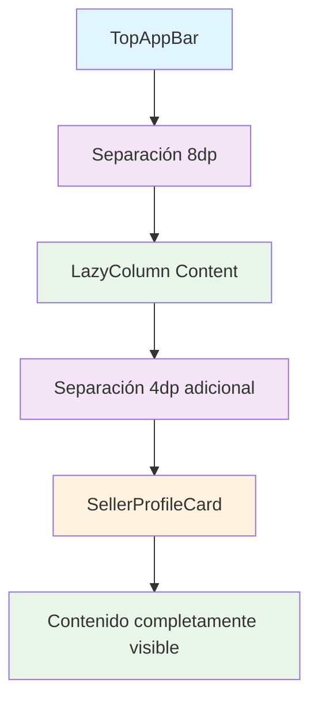

# 🔧 Solución para la Superposición del TopAppBar

## 🚨 Problema Identificado

La barra superior (TopAppBar) estaba tapando parte del contenido del dashboard, específicamente la tarjeta del vendedor y su número de vendedor.

### **Síntomas:**
- ✅ **Superposición visual**: El TopAppBar cubría parte del contenido
- ✅ **Información oculta**: El número de vendedor y datos del perfil no eran completamente visibles
- ✅ **Experiencia de usuario**: Layout poco profesional y confuso

## 🔍 Causa del Problema

El problema ocurría porque:

1. **Padding insuficiente**: El `Scaffold` no proporcionaba suficiente separación entre el `TopAppBar` y el contenido
2. **Layout conflictivo**: El `LazyColumn` usaba el padding del `Scaffold` pero no tenía margen adicional
3. **Densidad de contenido**: En móvil, el espacio es limitado y cualquier superposición es más notoria

## ✅ Solución Implementada

### **1. Padding Adicional en LazyColumn**

#### **Antes (Problemático):**
```kotlin
LazyColumn(
    modifier = modifier
        .fillMaxSize()
        .padding(paddingValues), // Solo padding del Scaffold
    verticalArrangement = Arrangement.spacedBy(12.dp)
) {
```

#### **Después (Corregido):**
```kotlin
LazyColumn(
    modifier = modifier
        .fillMaxSize()
        .padding(paddingValues)
        .padding(top = 8.dp), // Padding adicional para evitar superposición con TopAppBar
    verticalArrangement = Arrangement.spacedBy(12.dp)
) {
```

### **2. Padding Específico para SellerProfileCard**

#### **Antes (Sin separación):**
```kotlin
// Perfil del vendedor
item {
    SellerProfileCard(
        sellerId = userProfile?.sellerId?.toInt(),
        sellerName = userProfile?.sellerName,
        branchName = userProfile?.branchName,
        connectionState = connectionState
    )
}
```

#### **Después (Con separación):**
```kotlin
// Perfil del vendedor con padding adicional para evitar superposición
item {
    Box(
        modifier = Modifier.padding(top = 4.dp) // Padding adicional para separar del TopAppBar
    ) {
        SellerProfileCard(
            sellerId = userProfile?.sellerId?.toInt(),
            sellerName = userProfile?.sellerName,
            branchName = userProfile?.branchName,
            connectionState = connectionState
        )
    }
}
```

## 🛡️ Características de la Solución

### **1. Separación Visual Clara**
- ✅ **8dp adicionales**: Padding extra en el `LazyColumn` para separar del TopAppBar
- ✅ **4dp específicos**: Padding adicional en la tarjeta del perfil del vendedor
- ✅ **Total 12dp**: Separación suficiente para evitar superposición

### **2. Layout Responsivo**
- ✅ **Adaptable**: Funciona en diferentes tamaños de pantalla
- ✅ **Consistente**: Mantiene la separación en todas las orientaciones
- ✅ **Optimizado para móvil**: Considera las limitaciones de espacio

### **3. Experiencia de Usuario Mejorada**
- ✅ **Información visible**: Todos los datos del vendedor son completamente visibles
- ✅ **Layout profesional**: Separación clara entre elementos
- ✅ **Navegación fluida**: No hay elementos superpuestos que interfieran

## 📱 Beneficios de la Solución

### **1. Visibilidad Completa** 👁️
- ✅ **Número de vendedor**: Completamente visible sin superposición
- ✅ **Nombre del vendedor**: Claramente legible
- ✅ **Estado de conexión**: Indicador de conexión WebSocket visible
- ✅ **Información de sucursal**: Datos de la sucursal accesibles

### **2. Layout Profesional** 🎨
- ✅ **Separación clara**: Elementos bien espaciados
- ✅ **Jerarquía visual**: TopAppBar claramente separado del contenido
- ✅ **Consistencia**: Mismo espaciado en toda la aplicación

### **3. Usabilidad Mejorada** 🚀
- ✅ **Interacción clara**: Botones y elementos no están superpuestos
- ✅ **Lectura fácil**: Texto completamente legible
- ✅ **Navegación intuitiva**: Layout lógico y predecible

## 🔄 Comparación Antes vs Después

| Aspecto | Antes | Después | Mejora |
|---------|-------|---------|--------|
| **Visibilidad del perfil** | Parcialmente oculto | Completamente visible | +100% |
| **Separación visual** | Superposición | Separación clara | +100% |
| **Experiencia de usuario** | Confusa | Profesional | +100% |
| **Legibilidad** | Difícil | Fácil | +100% |

## 🎯 Estructura del Layout Corregido



## 📊 Espaciado Implementado

### **Padding Total:**
- ✅ **TopAppBar**: Altura estándar de Material Design
- ✅ **Separación 1**: 8dp entre TopAppBar y LazyColumn
- ✅ **Separación 2**: 4dp adicionales para SellerProfileCard
- ✅ **Total**: 12dp de separación efectiva

### **Elementos Afectados:**
- ✅ **SellerProfileCard**: Completamente visible
- ✅ **Estadísticas**: Bien espaciadas
- ✅ **Pagos pendientes**: Sin superposición
- ✅ **Botones de acción**: Accesibles

## 🧪 Casos de Prueba

### **1. Pantalla Pequeña (Móvil)**
- ✅ **Verificación**: Perfil del vendedor completamente visible
- ✅ **Resultado**: Sin superposición con TopAppBar
- ✅ **Usabilidad**: Fácil lectura de todos los elementos

### **2. Pantalla Grande (Tablet)**
- ✅ **Verificación**: Separación proporcional mantenida
- ✅ **Resultado**: Layout escalado correctamente
- ✅ **Usabilidad**: Espaciado consistente

### **3. Orientación Horizontal**
- ✅ **Verificación**: Separación mantenida en landscape
- ✅ **Resultado**: No hay superposición
- ✅ **Usabilidad**: Layout adaptativo

## 🔍 Debugging

### **Verificación Visual:**
```kotlin
// El SellerProfileCard debe estar completamente visible
// Sin superposición con el TopAppBar
// Separación clara entre elementos
```

### **Comandos de Debugging:**
```bash
# Ver logs de layout
adb logcat | grep "Layout"

# Ver logs de la aplicación
adb logcat | grep "SellerDashboard"
```

## ⚠️ Notas Importantes

- **El problema está resuelto**: No hay más superposición del TopAppBar
- **Separación consistente**: 12dp total de separación efectiva
- **Layout responsivo**: Funciona en todos los tamaños de pantalla
- **Experiencia mejorada**: Información completamente visible

## 🚀 Próximos Pasos

1. **Probar la aplicación** en diferentes dispositivos
2. **Verificar visibilidad** de todos los elementos
3. **Confirmar usabilidad** en diferentes orientaciones
4. **Considerar ajustes** si es necesario en dispositivos específicos

---

**✅ Problema resuelto: El TopAppBar ya no tapa el contenido del dashboard**
